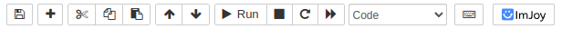

# itkwidgets

[](https://itkwidgets.readthedocs.io/en/latest/?badge=latest)
[](https://github.com/InsightSoftwareConsortium/itkwidgets/actions/workflows/notebook-test.yml)

Interactive widgets to visualize images, point sets, and 3D geometry on the web.

# Getting Started

## Installation

### Jupyter Notebook

To install the widgets for the Jupyter Notebook with pip:

```bash
pip install 'itkwidgets[notebook]>=1.0a8'
```

Then look for the ImJoy icon at the top in the Jupyter Notebook:



### Jupyter Lab

For Jupyter Lab 3 run:

```bash
pip install 'itkwidgets[lab]>=1.0a8'
```

Then look for the ImJoy icon at the top in the Jupyter Notebook:


### Google Colab

For Google Colab run:

```bash
pip install 'itkwidgets>=1.0a8'
```

## Example Notebooks

Example Notebooks can be accessed locally by cloning the repository:

```bash
git clone -b main https://github.com/InsightSoftwareConsortium/itkwidgets.git
```

Then navigate into the examples directory:

```bash
cd itkwidgets/examples
```

## Usage

In Jupyter, import the view function:

```python
from itkwidgets import view
```

Then, call the view function at the end of a cell, passing in the image to examine:

```python
view(image)
```

For information on additional options, see the view function docstring:

```python
view?
```

See the [deployments](deployments.md) section for a more detailed overview of additional notebook
options as well as other ways to run and interact with your notebooks.

# Learn more

Visit the [docs](https://itkwidgets.readthedocs.io/en/latest/) for more information on supported notebooks and integrations.
