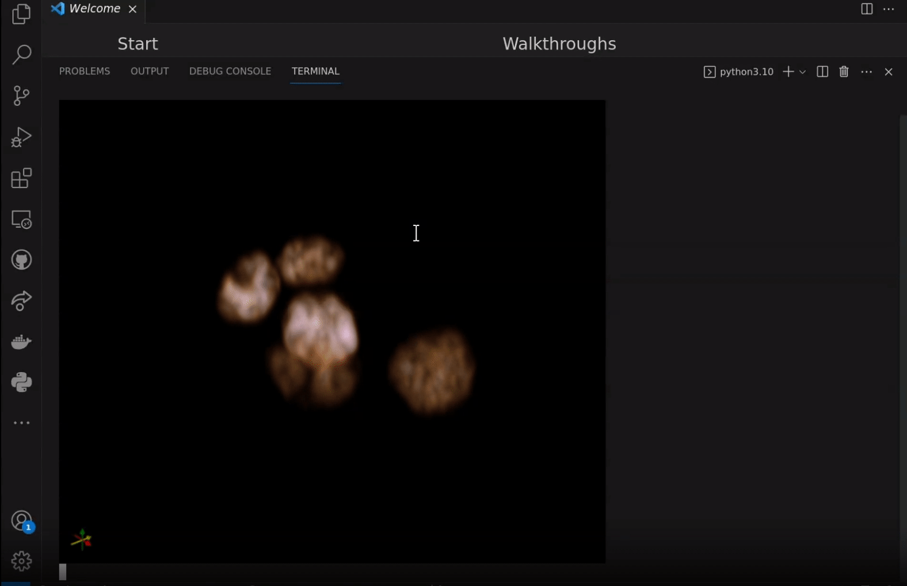

# Deployments

## JupyterLite

<a href="./_static/lab/index.html">
Try it!


</a>

[JupyterLite](https://jupyterlite.readthedocs.io/en/latest/) is a JupyterLab distribution that runs entirely in the browser built from the ground-up using JupyterLab components and extensions.

To use itkwidgets in a JupyterLite deployment, install the
[imjoy-jupyterlab-extension](https://pypi.org/project/imjoy-jupyterlab-extension/)
JupyterLab 3 federated extension in the environment used to build JupyterLite.
See also [the JupyterLite configuration used for this
documentation](https://github.com/InsightSoftwareConsortium/itkwidgets/blob/main/docs/jupyterlite/jupyterlite_config.json).
Currently, [this dask-image
wheel](https://github.com/InsightSoftwareConsortium/itkwidgets/blob/main/docs/jupyterlite/pypi/dask_image-2022.9.0-py2.py3-none-any.whl)
should also be added to the *pypi* directory of the jupyterlite configuration.

In the Pyodide notebook,

```python
import piplite
await piplite.install("itkwidgets==1.0a24")
```

See also the [Sphinx / ReadTheDocs
configuration](https://github.com/InsightSoftwareConsortium/itkwidgets/blob/main/docs/conf.py)
used for this documentation.

## Colab

[Google Colab](https://research.google.com/colaboratory/) is a free-to-use hosted Jupyter notebook service that provides
computing resources including GPUs and itkwidgets is now supported in Colab
notebooks! You can get started with a demo notebook: [](https://colab.research.google.com/github/InsightSoftwareConsortium/itkwidgets/blob/main/examples/Hello3DWorld.ipynb)

Or visit the [welcome page](https://colab.research.google.com/?utm_source=scs-index) to upload your own notebook or create one from scratch.


Notebooks can be uploaded from a repository, Google Drive, or your local machine.


## Jupyter Notebook

To use itkwidgets locally first [install Jupyter Notebook](https://jupyter.org/install#jupyter-notebook) and start Jupyter:

```bash
pip install notebook
jupyter notebook
```

If you'd rather interact with remotely hosted notebooks you can also open them
in Binder: [](https://mybinder.org/v2/gh/InsightSoftwareConsortium/itkwidgets/main?urlpath=%2Fnotebooks%2Fexamples%2F)

## JupyterLab

To use itkwidgets locally first [install JupyterLab](https://jupyter.org/install#jupyterlab) and start Jupyter:

```bash
pip install jupyterlab
jupyter lab
```

If you'd rather interact with remotely hosted notebooks in JupyterLab you can
also open them in Binder: [](https://mybinder.org/v2/gh/InsightSoftwareConsortium/itkwidgets/main?labpath=examples%2F)

## Command Line (CLI)

To enable quick inspection of your 3D data in the browser or in your terminal you can install the command-line tool.

```bash
pip install 'itkwidgets[cli]>=1.0a35'
playwright install --with-deps chromium
```
Previewing data in the terminal requires support for the iterm2 inline image protocol. Examples of terminals with this support include [wezterm](https://wezfurlong.org/wezterm/), [VSCode's Terminal](https://code.visualstudio.com/updates/v1_80#_image-support) (with VSCode >= v1.80), and [iTerm2](https://iterm2.com/index.html).

**Note**: If you are using VSCode but are not seeing the images output in the terminal confirm that you are on version `1.80` or later. You may also need to make sure that `Integrated: Gpu Acceleration` is set to `on` rather than `auto`. Find this under `File > Preferences > Settings` and search for `Gpu Acceleration`.

For basic usage the following flags are most commonly used:

**Data Input**
* `-i, --image`: The path to an image data file. This flag is optional and the image data can also be passed in as the first argument without a flag.
* `-l, --label-image`: Path to a label image data file
* `-p, --point-set`: Path to a point set data file
* `--reader`: Backend to use to read the data file(s) (choices: "ngff_zarr", "zarr", "itk", "tifffile", "imageio")

**For use with browser output**
* `-b, --browser`: Render to a browser tab instead of the terminal.
* `--repl`: Start interactive REPL after launching viewer. This allows you to programmatically interact with and update the viewer.

**For use with terminal or browser output**
* `--verbose`: Print all log messages to stdout. Defaults to supressing log messages.
* `-r, --rotate`: Continuously rotate the camera around the scene in volume rendering mode.
* `-m, --view-mode`: Only relevant for 3D scenes (choices: "x", "y", "z", "v")

### Examples

View the data in the terminal while rotating the camera:
```bash
itkwidgets path/to/data -r
```


View the image data in the browser and then programatically set the label image:
```bash
itkwidgets -i path/to/data --reader itk --repl
```

```python
>>> import itk
>>> label = itk.imread("path/to/label_image")
>>> viewer.set_label_image(label)
```
