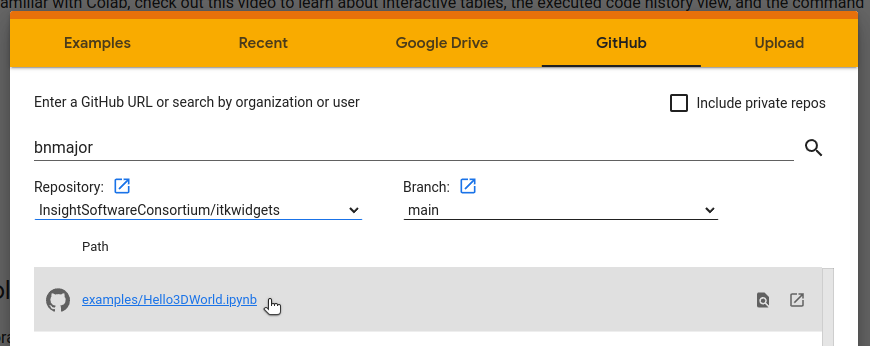

# Deployments

## JupyterLite

<a href="./_static/lab/index.html">
Try it!


</a>

[JupyterLite](https://jupyterlite.readthedocs.io/en/latest/) is a JupyterLab distribution that runs entirely in the browser built from the ground-up using JupyterLab components and extensions.

To use itkwidgets in a JupyterLite deployment, install the
[imjoy-jupyterlab-extension](https://pypi.org/project/imjoy-jupyterlab-extension/)
JupyterLab 3 federated extension. Optionally, pre-install the itkwidgets wheel
and its dependency. In the Pyodide notebook,

```python
import piplite
piplite.install("itkwidgets==1.0a23")
```

Here we are installing the specific pre-release version pre-installed. See
also [the JupyterLite configuration used for this documentation](https://github.com/InsightSoftwareConsortium/itkwidgets/blob/main/docs/jupyterlite/jupyterlite_config.json) and the
[Sphinx / ReadTheDocs
configuration](https://github.com/InsightSoftwareConsortium/itkwidgets/blob/main/docs/conf.py)
used for this documentation.

## Colab

[Google Colab](https://research.google.com/colaboratory/) is a free-to-use hosted Jupyter notebook service that provides
computing resources including GPUs and itkwidgets is now supported in Colab
notebooks! You can get started with a demo notebook: [](https://colab.research.google.com/github/InsightSoftwareConsortium/itkwidgets/blob/main/examples/Hello3DWorld.ipynb)

Or visit the [welcome page](https://colab.research.google.com/?utm_source=scs-index) to upload your own notebook or create one from scratch.



Notebooks can be uploaded from a repository, Google Drive, or your local machine.


## Jupyter Notebook

To use itkwidgets locally first [install Jupyter Notebook](https://jupyter.org/install#jupyter-notebook) and start Jupyter:

```bash
pip install notebook
jupyter notebook
```

If you'd rather interact with remotely hosted notebooks you can also open them
in Binder: [](https://mybinder.org/v2/gh/InsightSoftwareConsortium/itkwidgets/main?urlpath=%2Fnotebooks%2Fexamples%2F)

## JupyterLab

To use itkwidgets locally first [install JupyterLab](https://jupyter.org/install#jupyterlab) and start Jupyter:

```bash
pip install jupyterlab
jupyter lab
```

If you'd rather interact with remotely hosted notebooks in JupyterLab you can
also open them in Binder: [](https://mybinder.org/v2/gh/InsightSoftwareConsortium/itkwidgets/main?labpath=examples%2F)
