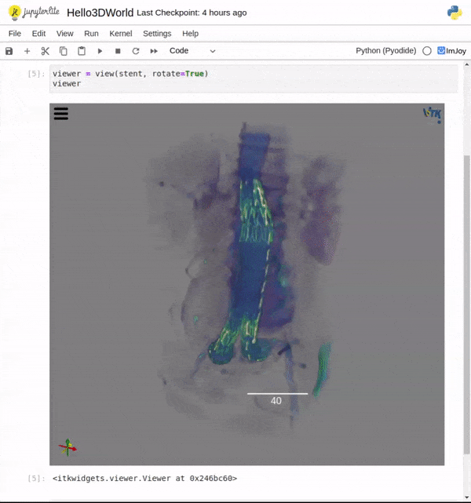

# Welcome to itkwidgets's documentation!

```{note}
This is the **pre-release alpha** documentation for **itkwidgets 1.0**, which
has first-class support for
[JupyterLite](https://jupyterlite.readthedocs.io/en/latest/),
[JupyterLab](https://jupyterlab.readthedocs.io/en/stable/), [Google
Colab](https://research.google.com/colaboratory/), and more. itkwidgets-1.0 is
powered by [itk-wasm](https://wasm.itk.org) and [ImJoy](https://imjoy.io/).
*Welcome to The Future* 🔬🚀🛸!
```

<a href="./_static/retro/notebooks/?path=Hello3DWorld.ipynb">
Try it with JupyterLite!



</a>

```{toctree}
:maxdepth: 4
:caption: 📖 Learn

quick_start_guide
deployments
integrations
advanced
```

```{toctree}
:maxdepth: 3
:caption: 📖 Reference

apidocs/index.rst
```

```{toctree}
:maxdepth: 2
:caption: 🔨 Contribute

development
Code of Conduct <https://docs.itk.org/en/latest/contributing/code_of_conduct.html>
```
